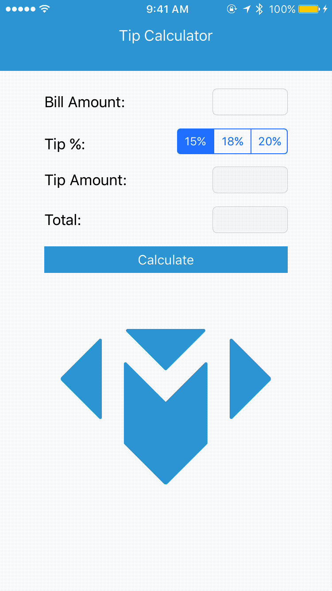

In this tutorial, you'll learn the basics of iOS by building your first app: a tip calculator!

In the US, it's customary to leave a tip for waiting staff like bartenders and waiters. An accepted range for the tip, also known as gratuity, is between 15% to 20% of your total bill.

Instead of having to do the math in your head, we'll build a simple tip calculator to calculate the tip for us.

**Estimated completion: 2 hours**

# What We'll Build

At the end of this tutorial, you'll have built your own tip calculator!

Your tip calculator will be able to:

1. Accept a bill amount as input to calculate the tip amount
1. Choose a preset tip percentage of 15%, 18%, or 20%
1. Calculate the total bill amount (bill + tip) by pressing the calculate button

# Before You Begin

## Prerequisites

To complete this tutorial, you'll need:

- basic understanding of Swift fundamentals

If you haven't been introduced to Swift yet, or even just need a refresher, check out Make School's _Getting Started With Swift_ tutorial.

## Objectives

By the end of this tutorial, you will:

- create a new Xcode project
- navigate and get familiar using Xcode
- build user interface (UI) with _Interface Builder_
- write code that connects to your UI
- run and launch your app on your iPhone

# Important: Read Me!

Now that I have your attention...

To succeed as an iOS developer and build awesome apps, you'll need to know more than just code. This tutorial will introduce new topics like _getting to know Xcode_ and _building UI with Interface Builder_, many which do not involve writing code. This might seem irrelevant at first, however you won't be able to build iOS apps without learning about these subjects first.

As you go through the tutorial, make sure you pay attention when learning how to use Xcode. As an iOS developer, the more familiar you are with Xcode, the easier it'll be to build apps!

Most importantly, make sure you're having fun. Building iOS apps is challenging. But it's also extremely rewarding. There's no feeling like watching your own apps come to life and the pride from knowing you built it yourself!

# If You Get Stuck

Getting stuck on problems and debugging is a natural part of programming? If you do find yourself stuck, re-trace your steps and make sure you've followed the tutorial step-by-step. Many times, it's easy to make typos or skip over important steps.

If you want to compare your code to the solution, you can [download it here.](https://github.com/MakeSchool-Tutorials/Tip-Calculator-Swift3-Solution/archive/master.zip)

<!-- move this to section about introducing Xcode -->

<!-- This is much more of a tutorial about Xcode then it is about programming. If you have never used an _Integrated Development Environment_ (IDE) before, this will get you acquainted with the minimum required knowledge to be proficient in Xcode, and even give you a taste of some of the more advanced stuff. Many times you may see multiple ways to do the same thing -- repetition is key. Our intent here is to show you as many ways as we can in the short duration of this tutorial. -->

<!-- A builder can only be as good as their tools, and luckily for us, Apple builds their products with _Xcode_ and is continuously improving it! What is the greatest sign of that? During the writing of this tutorial, _Xcode_ crashed exactly 0 times. That is what you need to strive towards when you ship your own apps! -->
