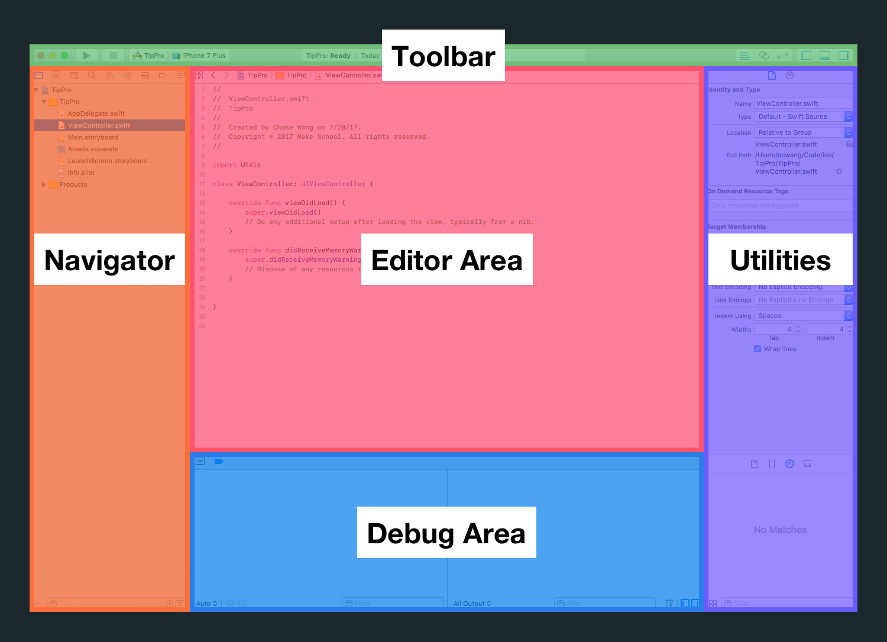
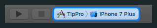
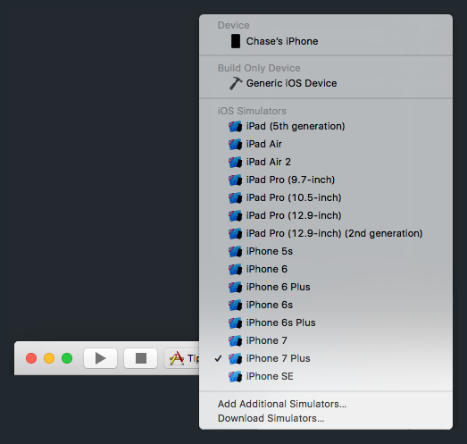
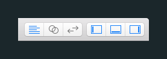
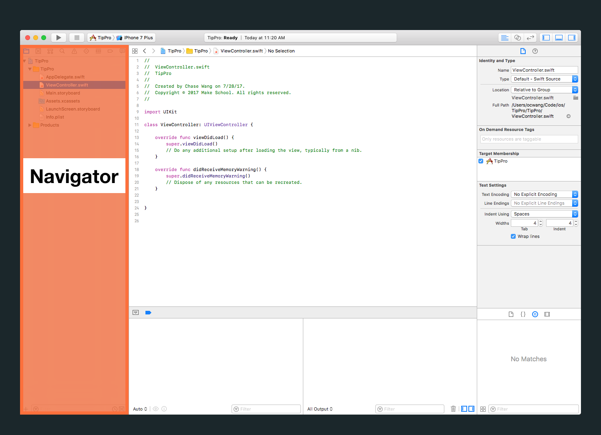
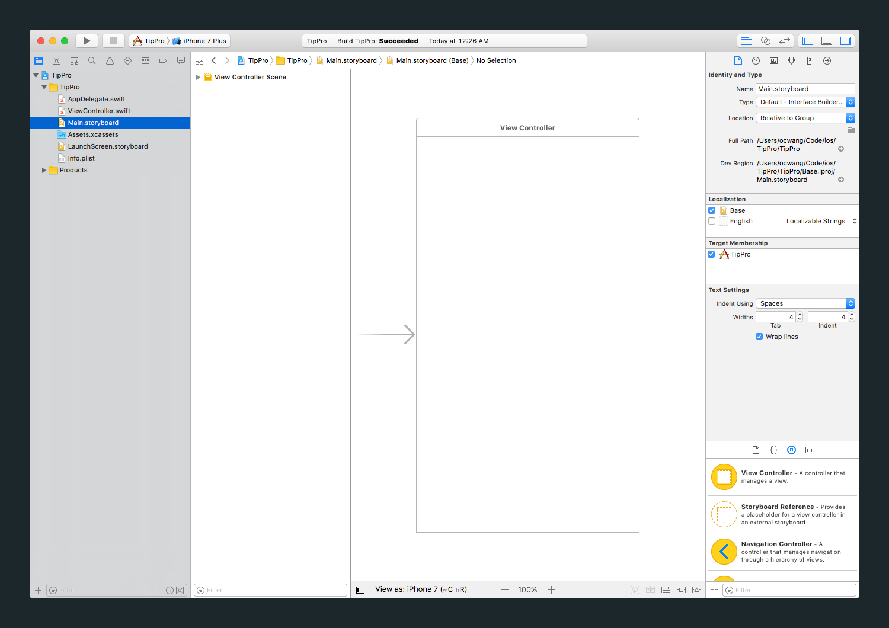

As discussed previously, much of this tutorial will be learning about and getting familiar with Xcode. In this section, we'll have our first formal introduction with Xcode.

# What is Xcode?

Xcode is an _Integrated Development Environment_ (IDE) for developing apps in the Apple ecosystem. This includes macOS, iOS, watchOS, and tvOS apps. IDEs (like Xcode) contain and integrate many powerful tools that make software development easier for programmers.

As you learn to build apps in Xcode, you'll use many of these tools. Tools that you'll use commonly on a daily basis include:

- Source Code Editor: write and edit code
- Interface Builder: build and visualize user interfaces (UI) without code
- Debugger: test, catch and debug problems in your code
- Compiler: helps you find mistakes in your code and offers "Fix-its" suggestions
- Assistant Editor: edit multiple files in Xcode side-by-side
- Simulator: test and run your app on a simulated iPhone on your computer

## Why Xcode?

Although it's technically possible to write iOS apps without using Xcode, it's not worth the trouble. If you're serious about making iOS apps, you must become fluent with using Xcode!


> [info]
It's important to note, that Xcode contains many more advanced, powerful tools than the ones mentioned here. These are out of the scope of this tutorial.

## Terms and Definition

- compile-time
- run-time
- debug
- user interface (UI)
- camel-case
- dynamic
- static

If you ever get confused or can't remember code-related jargon, don't hesitate to do a quick Google to refresh your memory!

# Your First Xcode Project

Firsts are always special. Now that we're a little more familiar with Xcode, we'll begin by creating our _first_ Xcode project.

Get familiar with this process, you'll repeat it over and over whenever you start a new app!

> [action]
Create a new Xcode project:
>
1. Open _Xcode_ on your computer. You should see the following launch window after you open Xcode 
1. Next, from the launch window's quick options click `Create a new Xcode project` 
1. You should see the following prompt to select a template for your new project. Under _iOS_, select _Single View App_ 
1. With your selected template, click _Next_. You should see a new prompt for your project details 

In this new prompt, we'll set some basic info and details that Xcode needs to create a new project.

> [action]
In the project details prompt, enter the following information:
>
1. In the _Product Name_ field, enter `TipPro`. This is what Xcode will name your project in your file directory. To prevent potential name-related problems, it's best to stick with alphanumeric characters (letters and numbers) and avoid special characters.
1. In the _Team_ dropdown menu, set it as `None`. If you already have an `Apple Developer Team`, you can select that instead.
1. In the _Organization Name_, you can enter one of the following: your name, your fake company name, or _Make School_.
1. In the _Organization Identifier_, set it as _com.makeschool_. If you own a domain name, you can set this field as your reverse domain name. For example, if you own the domain name _happycarrot.com_, you would put _com.happycarrot_ as your identifier.
1. The _Bundle Identifier_ will be automatically constructed from your _Organization Identifier_ and _Product Name_. Apple uses the bundle identifier to uniquely identify each app in the _App Store_.
1. In the _Language_ dropdown menu, make sure it's set to `Swift`.
1. Finally, leave all three checkboxes unchecked. We won't use _Core Data_ or testing in this tutorial.

When you're finished, you should have something similar to the following:


> [action]
To finish up and create our new project:
>
1. After filling out your project details above, click _Next_. 
1. Xcode will now prompt you to select where you'd like to store your project. Using the file navigator, choose to a place on your computer to store your project. If you don't have a place in mind, you can use your `Documents` folder. 
1. Make sure you keep the _Source Control_ checkbox selected for _Create Git repository on my Mac_. 
1. After you've selected a project location and verified that the _Source Control_ checkbox is selected, click the `Create` button. 

Congrats! Meet your first new project. You should see the following:


Can you feel the sparks? I think this is the start of something special.

# Getting To Know Xcode

Before we can start making our app, we'll first need to learn about Xcode and how it works.

In this step, we'll get familiar with Xcode. We'll learn about each of the different tools Xcode gives us so we can build our tip calculator.

When you create a new project or open a previously existing project, you should see something similar to the following:


Woah! At first glance, you'll notice there's a lot going on. Tabs, buttons, panels and text fields everywhere!

If you feel overwhelmed, take a deep breath.

In the next step, we'll walk through Xcode together and learn how to harness it's power.

## Navigating Xcode

Xcode is broken down 4 main areas + a toolbar:



Here's a quick breakdown of each of the areas above:

1. Toolbar: displays key information about project, expand/collapse other areas, run project
1. Navigator: find files, search in your project, manage source control, navigate errors
1. Editor Area: write code, build UI with storyboard, change project settings
1. Utilities: gives info about files, set properties of items in Interface Builder
1. Debug Area: test and debug your code at runtime

Each area has many more tools and features built-in, so don't think of the summary above as a comphrensive list. We've just highlighted the key functions of each part of Xcode. Next, we'll explore each area for a better understanding of what each area does.

# Toolbar

First, we'll start by learning about the toolbar and what it does.


## Running Your App

If you look at the first group of buttons on the left-hand side, you should see:


This section allows you to build and run your app on either a simulator or your iPhone.

### Run Button


The _Run_ button will build and run your app on a specified device.

### Stop Button


The _Stop_ button (looks like a square) will stop the instance of your app if it is currently running.

### Scheme Dropdown



The _Scheme_ dropdown menu will allow you to edit and manage multiple _schemes_. A _scheme_ defines what Xcode does when you run your app.

When you click the _Run_ button, it builds and runs the selected scheme. In our case, the _Run_ button will launch our app on the selected device.

You can also specify a simulator or device that your want your scheme to run on. Click on the right-side of the _Scheme_ dropdown to see a full list of options. If you connect your iPhone to your computer, you'll see your device to show up as an option as well.



### Putting It Together

Now that we know more, let's build and run our app.

> [action]
1. Change the _Scheme Device_ dropdown to an iOS `iPhone 7 Plus` simulator. 
1. Click the _Run_ button. You can also use the keyboard shortcut, command-R (CMD-R) 

The first time you run your app, you may see a dialog that asks for your password:


Enter and click `Continue`. This permission is necessary to run your app using the _debugger_ (more on this later.)

If all goes well, you'll see a simulator with your app launch:


If you're wondering why there's just a blank white screen, it's because we haven't added anything to our app yet.

## Xcode Status Bar

Next we'll look at the status bar in the middle of the toolbar:


The status bar displays key information about Xcode and your project. This includes the following:

- building, running, stopped status info
- project warnings and errors

Whenever you build, run or stop your project, the status bar will let you know Xcode's status and if the action was successful. You might have noticed when you clicked the _Run_ button in the previous step.

Let's look at some of the status updates the status bar provides.

### Building

<!-- FIXME: student's probably don't even know what building is -->


When the Xcode builds your app, you'll even see a progress bar with details on what happening during the build process.

Even better, Xcode will let your know warnings and errors found during the build process:


Notice the 2 warnings and 7 errors on the right most side of the status bar. In your own projects, you should make sure there are **no** warnings or errors in your project.

### Running

Xcode will also let you know when an instance of your project is running on a device or simulator:


Or if it's finished running:


## Xcode View Options

Last, we'll look at the last set of buttons on the far right of the toolbar:



Each of these buttons hides or displays different views options for Xcode.

### Editor Modes


The first three buttons toggle the editor between three modes (from left to right):

- Standard Editor: the default editor for displaying and editing files
- Assistant Editor: edit two or more files side-by-side at the same time
- Version Editor: view versioning and source control details of your files

You can see from the gif below how clicking on each button corresponding to each editor type changes the editor area:


### Hiding and Showing Xcode Area

The last three buttons hide and show 3 of the main Xcode areas we learned about earlier: Navigator, Debug Area, Utilities.


These buttons allow you to display each respective area when you need it and hide it otherwise. By only displaying areas that we need, we can save more screen space for displaying and editing code!


In this step, we've looked at the toolbar and all it's components. Next, we'll briefly cover the 4 main areas of Xcode.

# Navigator



The navigator pane contains multiple tabs (called navigators) for many different tools in Xcode.

You can change tabs by clicking on the different icons at the very top of the navigator.


Each of these navigator tabs are useful tools that you'll eventually learn to use. Some of the most important ones are:

- _Project navigator_: navigate and change files
- _Source Control navigator_: manage versioning and source control
- _Find navigator_: search through your project to find files
- _Issue navigator_: locate and fix warnings and errors in your project

In this tutorial, we'll only focus on the first tab, the _Project navigator_.

<!-- TODO: seems like the Issue navigator should also be covered -->

### Project Navigator

In your Navigator pane, click on the first tab which is an icon that looks like a file.

You should see the following:


There are many different types of files in our Xcode project. Let's take a look at some of them now.

Currently, in the image above, the file _ViewController.swift_ is selected. Instead, let's click on and navigate to the _Project Settings_:

You should see the following in your _Navigator_ and _Editor Area_:


Every time you select a different file in the _Project Navigator_, it'll be displayed in the _Editor Area_. Right now we're looking at our project settings. Here we can change project settings such as the app display name, minimum device OS, and many more default project configurations.

Next, let's open _ViewController.swift_:


_ViewController.swift_ is a default source file that comes included in every _Single App_ template Xcode project. As you can see files with a _.swift_ extension contain _Swift_ code that will be used to implement logic for your apps.

Next, switch to the _Main.storyboard_ file using your _Project Navigator_:



You'll notice the _Editor area_ has completed changed again. You view and edit _.storyboard_ files with _Interface Builder_ which allow you to quickly create UI and user flows for your app. We'll learn more about this in upcoming sections.

> [info]
If you look at what's in the storyboard, you might recognize something familiar: the blank, white screen that we saw earlier when we ran the simulator!

# Editor Area

Through using the _Project Navigator_, we've casually been introduced to the _Editor area_.


As you can probably guess, the _Editor area_ is used for viewing and editing files. You'll use this area for writing code in _.swift_ files, building UI in _Interface Builder_ and much more. We've already covered how to switch between these different files.

Before we move on, let's go over the assistant editor again. You might recall that you can switch between Editor types using the toolbar buttons we cover earlier:


If you click on the middle button (looks like two overlapping circles) you'll see the assistant editor.


You can use the assistant editor to open and edit multiple files side-by-side. This will be important when you're connecting UI in _.storyboard_ files to code in _.swift_ files.

Click on the first button of the editor types in your Xcode toolbar to change your editor back to the standard editor.

As you can start to see, all of the tools, areas and components of Xcode work together to help you easily build apps.

# Utilities

Next, let's take a quick look at the _Utilities_ pane.

> [action]
First, navigate to your _Main.storyboard_ file using your _Project Navigator_.

Make sure your _Utilities_ pane is open with your toolbar. You should the following:


Just like the _Navigator_, the _Utilities_ pane has multiple different tabs called inspectors.


The first inspector is the file inspector that gives you more information about the currently selected file.

Let's switch to the _Attributes Inspector_, the 4th inspector from the left. You should see the following:


Next, click on the _ViewController_ in the storyboard. Use the _Document Outline_ on the left-side of the editor to make sure you have the _View_ selected.


Notice that the info and options in the _Utilities_ pane has completely changed. This is because the _Utilities_ displays details and options for whatever item is currently selected. This applies to files, code, and as you just saw, objects in storyboard.

> [action]
With the _View_ selected, use the _Attributes Inspector_ to change the background color from white to another color.
>


With our new change, run the app in a simulator. What do you see?


> [challenge]
Before moving on, set the background color of your _View_ back to white.

### Object Library

We've covered the top half of the _Utilities_ pane. Now, let's briefly discuss the bottom half of the _Utilities_ pane.


The bottom half of the utilities allows you to drag pre-built components from your library into your project. These components include file templates, code snippets, and IB objects.

You'll mainly be using this pane for the object library to drag and drop IB objects into your _.storyboard_ files.

# Debug Area

The last main area we need to discuss is the _Debug area_.

The _Debug area_ will help you to test and debug your code for runtime errors. That means if you get unexpected behavior or crashes, you can use the debugger to figure out whats causing problems.

A very basic form of debugging, or figuring out why unexpected behavior is happening, is by using print statements. Let's try that out now.

> [action]
Navigate to _AppDelegate.swift_ using your project navigator. In the function, `func application(_ application: UIApplication, didFinishLaunchingWithOptions launchOptions: [UIApplicationLaunchOptionsKey: Any]?) -> Bool`, add the following code:
>
```
func application(_ application: UIApplication, didFinishLaunchingWithOptions launchOptions: [UIApplicationLaunchOptionsKey: Any]?) -> Bool {
    // Override point for customization after application launch.
>
    let secretMessage = "spaces over tabs"
    print("secret message: \(secretMessage)")
>
    return true
}
```

After you've made the changes above to your app delegate, run your project in the simulator. Notice that when the app launches, the print statement is logged in the _Debug Console_.


You can use print statements to make sure your app behaves as expected at runtime.

Although that are many more tips, tools, and tricks for using the debugger, we won't cover them in the scope of this tutorial.

Next, we'll move on to creating our UI for our tip calculator in our storyboard file.

# Quick Review

> So far, you should have:
>
1. Created your first Xcode project
1. Explored the Xcode interface
1. Learned more about each of Xcode's 4 main areas
>
