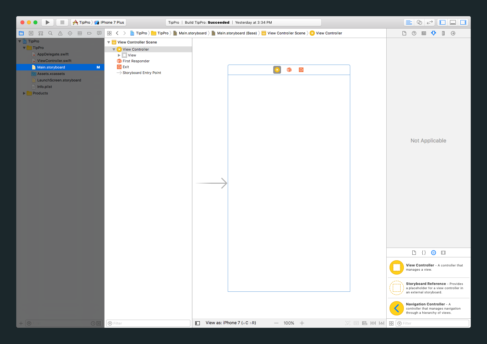
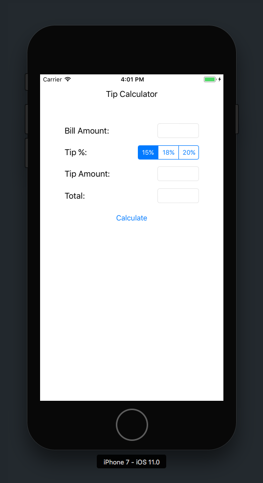

It's time to dive into building the UI (also referred to as views) for our tip calculator. We can build our UI either programmatically (with code) or in storyboard (with _Interface Builder_.) Each approach has different costs and benefits. In this tutorial, we'll build our UI with the _Interface Builder_ because of ease of use and the low learning curve.

> [info]
For most small projects, it's often easier to implement and manage with _Interface Builder_ than with code. If you're working with a large team or building complex UI elements, then you might want to consider building your views programmatically.

<!--  -->

>[action]
To begin building our UI, we'll need to open our storyboard file. Select the _Main.storyboard_ file in your project navigator. 

This should feel familiar. Remember how you changed the background color of the view controller in the previous step?

Next let's look at adding _IB objects_ from the _Object library_ (in the Utilities pane) to our view controller.

# Adding a Label

>[action]
Next we'll add a label to our view controller. Watch the video and follow the steps below:
>
1. On the bottom right of the screen, in the `Object library`, scroll until you find `Label`
1. Click and drag the `Label` into the white square in the middle of the screen (dashed-line guides will appear). You might need to zoom into the Storyboard if it won't let you drag the label in (pinch out on the trackpad or click the main area and press `command and +`)
>

In the _Utilities area_, you're active tab is the _Attributes Inspector_. The _Attributes Inspector_ displays all of the properties of the new label object you created. These properties can be set and modified both in code or the _Attributes Inspector_ of the _Interface Builder_.

Let's try this out now by changing the label's text.

>[action]
> ## Changing the label's text
>
> In the `Attributes Inspector` change the `Text` value from `Label` to `Tip Calculator` and press `enter`.
>

Uh oh. The label is too small to display the full text. We could use the little resizing squares to make it the right size, or even the aptly named `Size Inspector` to change its size. But we are going to use this opportunity to get started with the most powerful part of `Interface Builder`: auto-layout.

# Constraints and Auto-Layout

`Constraints` are an important part of a system called `Auto-Layout` that we can use to design our interface once, and have it automatically adjust to different screen sizes. It doesn't stop there, it can help if you want to support rotating the device and even other languages. 

Watch the video below for a quick intro to `Auto-Layout`.

>[action]
> ## Fixing the label alignment
> We want this label to be the top bar. To do this, we want the constraints to put it at the top and make it the full screen width. Watch the video and follow the steps below:
>
1. With the label selected, hold `control` while clicking and dragging upwards. Let go and hold `option` so you can click `Top space to container margin`.
1. With the label still selected, control-click (or right-click) drag from the label to the parent `View`. In the menu that appears, select `Equal Widths`. Select it again, control-click again, drag from the label to the parent `View` and from the menu select `Center Horizontally in Container`.
1. With the label still selected, press the `Pin` button (it looks kind of like a tie fighter!).
1. Check `height` and set it to `80`.
1. Click `Add 1 Constraint` and then click the `Update Frames` button (looks like a refresh button near `Pin` button).
1. The label is still in the center so we need to move it up! With the label selected, click the line going from it upwards and change `constant` to `0` in the  `Attributes Inspector`  (right side of screen).
>

Let's quickly review what we did there. We added `constraints` to the label, so that its size will be set automatically. We told the label that it should sit `0` pixels from the top, `0` pixels from the left, and `0` from the right. This forces it to match the full screen width!

These are not magic numbers, and as you progress, you will get a better idea for how things should look on the screen of a handheld device. Apple has so many thoughts on the subject, that they publish _Human Interface Guidelines_ that you can follow the rules they propose for all _user interfaces_ that you design. Also, in the future you will probably work with designers who will spend large amounts of time thinking about how things should look, and then you can translate their design into the right values for the interface. For now, we have selected `0`.

Next, we are going to start adding all the other interface labels and fields we'll need! We'll add them first and then start to fix the layout.

# Adding all the elements

We are going to get most of our layout on the screen all at once and then slowly fix it so it displays correctly. Our end goal is to have something that looks like this:

>[action]
> Watch the video and follow the steps below:
>
1. Drag a `label` from the `Object library` onto the screen (slight below the top label and just a bit left of center)
1. Drag a `text field` to the right of that label and use the guides to line up their vertical centers.
1. Click the `label` to select it, hold `shift` while clicking the `text field` to have them both selected.
1. While holding `option`, click and drag the selected `label` and `text field` down to copy it (see video for relative spacing).
1. Repeat the hold `option`, click and drag two more times so you have `4` pairs of `label` & `text field`.
1. Drag a `button` from the `Object library` under the labels.
>
> 

# Previewing our work

Great! We have a few labels, text fields, and even a button! We can preview our UI by running the app. This can get annoying if you are working somewhere deep in the app and want to test it out on multiple devices. Instead, you can use the "View as" button display a preview of the screen you are working on across multiple devices.

>[action]
>
Click on the `View as` button at the bottom of your storyboard. Play around with devices and see how it changes
>

Now you can check out some sample devices without having to launch your code. This is not a perfect solution and may not work when using custom controls you download from the internet or create yourself in the future. There are ways to make this work with these custom controls, but they may not be worth the tradeoff in time.

Let's see how they look in the simulator.

>[action]
>
> Run the app and rotate the simulator by clicking the play button to see how things move around when they are not set up with the proper pinning and constraints. The content looks fine in portrait mode, but it it is off in landscape! We don't actually need this to work in landscape but as we saw earlier, we have a bit more layout work to do...
>
You can rotate the simulator with `command + left/right arrow keys` or from the `Hardware menu -> Rotate Right / Left`.

# Adding a segmented control

Before we start to fix the layout, let's actually change the second text field to a `segmented control`. This will allow us to set up 3 options for tipping and make our interface a bit cleaner.

>[action]
> Watch the video and follow the steps below:
>
1. Click on the second `text field` to select it. Press `delete` on your keyboard to delete it!
1. Drag a `Segmented Control` from the `Object library` into its place (use the guides to position it).
1. In the `Attributes Inspector`, change the `segments` from `2` to `3`.
>
> 

# Fixing the widths

For the sake of consistency, we want all the `text fields` to have a width of `85` and the `segmented control` to have a width of `125`. Let's pin them to the correct values!

> [action]
> Watch the video and follow the steps below:
>
1. Click on the first `text field` to select it.
1. Hold `shift` and click on the other two `text field`s to select them as well.
1. Open the pin menu, check `width`, enter `85` and click `add 3 constraints` to apply the changes.
1. Click on the `segmented control` and do the same but set the `width` to `125`
>
> 

# Quick Review

> So far, you should have:
>
1. Added a label to your storyboard and changed it's text to read "Tip Calculator"
1. Learned the basics of Auto-Layout
1. Added constraints to your label
1. Created the basics of the User Interface by adding new labels, text fields, and a segmented control
1. Learned how to modify existing constraints
>
> Let's move on to the next page and fix up this layout!

TODO:
- 
