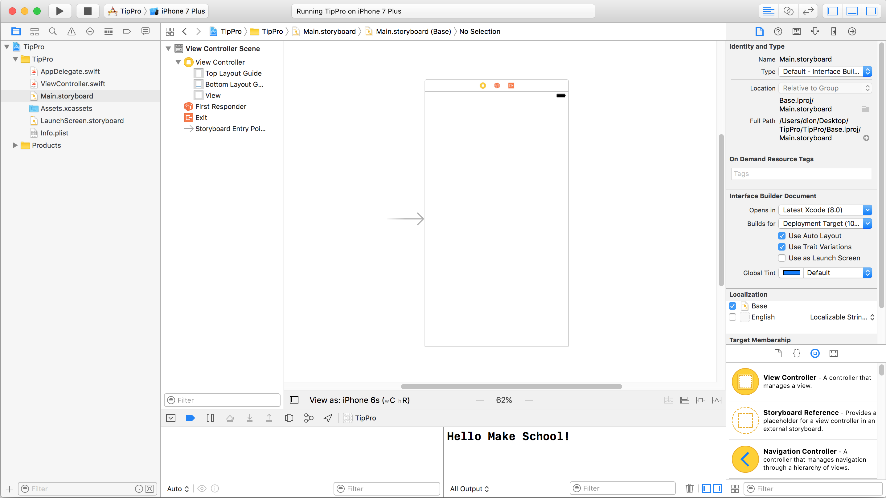

Now its time to dive into the `Utility Area`. Everything in the development world has choices. When it comes to making iOS apps, we have a choice in how we setup the graphical interface for our app. You can do it _programmatically_ with code or, you can do it graphically using the integrated _Interface Builder_. Yes, this is the tool first released in 1988 and its better than ever!

> [info]
If it's so good, why would you want to do it any other way? Thats a great question. Usually when you have more than one person working on an app, it is impossible to merge changes made to these interface files. Also, in the past, this tool did not provide much extra utility over writing your interfaces in code. But as time progressed, new iPhones came out with different screen sizes, and Apple introduced Auto-Layout. No, its not fully automatic, but if you are a solo developer, you need these tools to build apps that work seamlessly on different sized devices. They are also available in code, but we are going to get started with them graphically. We have a `Single View Application` so this is going to be as simple as it can get.

<!--  -->

>[action]
> ## Opening the storyboard
> Follow the steps below:
>
Select `Main.storyboard` from the project navigator.
>

Bask in its glory! In the `Utility Area` you can see a few attribute settings for the Storyboard, and some choices underneath in the `Object Browser`. Let's keep rolling.

# Adding a label

>[action]
> ## Adding a label
> Watch the video and follow the steps below:
>
1. On the bottom right of the screen, in the `Object Browser`, scroll until you find `Label`
1. Click and drag the `Label` into the white square in the middle of the screen (dashed-line guides will appear). You might need to zoom into the Storyboard if it won't let you drag the label in (pinch out on the trackpad or click the main area and press `command and +`)
>

Currently you are in the `Attributes Inspector` part of the `Utility Area`. In this area, you will see all the _Attributes_ of the `UILabel`. In code, these are the external _properties_ that you can set on a `UILabel` object. If you are planning to change those attributes dynamically, you will have to do that in code. But if you are going to set them once, including certain automatic/dynamic settings, you can do that here. Let's jump right in.

>[action]
> ## Changing the label's text
>
> In the `Attributes Inspector` change the `Text` value from `Label` to `Tip Calculator` and press `enter`.
>

Uh oh. The label is too small to display the full text. We could use the little resizing squares to make it the right size, or even the aptly named `Size Inspector` to change its size. But we are going to use this opportunity to get started with the most powerful part of `Interface Builder` that developers would have killed for back in 1988.

# Constraints and Auto-Layout

`Constraints` are an important part of a system called `Auto-Layout` that we can use to design our interface once, and have it automatically adjust to different screen sizes. It doesn't stop there, it can help if you want to support rotating the device and even other languages. Watch this video for a quick intro to `Auto-Layout`.

>[action]
> ## Fixing the label alignment
> We want this label to be the top bar. To do this, we want the constraints to put it at the top and make it the full screen width. Watch the video and follow the steps below:
>
1. With the label selected, hold `control` while clicking and dragging upwards. Let go and hold `option` so you can click `Top space to container margin`.
1. With the label still selected, control-click (or right-click) drag from the label to the parent `View`. In the menu that appears, select `Equal Widths`.  
1. With the label still selected, press the `Pin` button (it looks kind of like a tie fighter!).
1. Check `height` and set it to `80`.
1. Click `Add 1 Constraint` and then click the `Update Frames` button (looks like a refresh button near `Pin` button).
1. The label is still in the center so we need to move it up! With the label selected, click the line going from it upwards and change `constant` to `0` in the  `Attributes Inspector`  (right side of screen).
>

Let's quickly review what we did there. We added `constraints` to the label, so that its size will be set automatically. We told the label that it should sit `0` pixels from the top, `0` pixels from the left, and `0` from the right. This forces it to match the full screen width!

These are not magic numbers, and as you progress, you will get a better idea for how things should look on the screen of a handheld device. Apple has so many thoughts on the subject, that they publish _Human Interface Guidelines_ that you can follow the rules they propose for all _user interfaces_ that you design. Also, in the future you will probably work with designers who will spend large amounts of time thinking about how things should look, and then you can translate their design into the right values for the interface. For now, we have selected `0`.

Next, we are going to start adding all the other interface labels and fields we'll need! We'll add them first and then start to fix the layout.

# Adding all the elements

We are going to get most of our layout on the screen all at once and then slowly fix it so it displays correctly. Our end goal is to have something that looks like this:

>[action]
> Watch the video and follow the steps below:
>
1. Drag a `label` from the `Object Browser` onto the screen (slight below the top label and just a bit left of center)
1. Drag a `text field` to the right of that label and use the guides to line up their vertical centers.
1. Click the `label` to select it, hold `shift` while clicking the `text field` to have them both selected.
1. While holding `option`, click and drag the selected `label` and `text field` down to copy it (see video for relative spacing).
1. Repeat the hold `option`, click and drag two more times so you have `4` pairs of `label` & `text field`.
1. Drag a `button` from the `Object Browser` under the labels.
>
> 

# Previewing our work

Great! We have a few labels, text fields, and even a button! We can preview our UI by running the app. This can get annoying if you are working somewhere deep in the app and want to test it out on multiple devices. Instead, you can use the "View as" button display a preview of the screen you are working on across multiple devices.

>[action]
>
Click on the `View as` button at the bottom of your storyboard. Play around with devices and see how it changes
>

Now you can check out some sample devices without having to launch your code. This is not a perfect solution and may not work when using custom controls you download from the internet or create yourself in the future. There are ways to make this work with these custom controls, but they may not be worth the tradeoff in time.

Let's see how they look in the simulator.

>[action]
>
> Run the app and rotate the simulator by clicking the play button to see how things move around when they are not set up with the proper pinning and constraints. The content looks fine in portrait mode, but it it is off in landscape! We don't actually need this to work in landscape but as we saw earlier, we have a bit more layout work to do...
>
You can rotate the simulator with `command + left/right arrow keys` or from the `Hardware menu -> Rotate Right / Left`.

# Adding a segmented control

Before we start to fix the layout, let's actually change the second text field to a `segmented control`. This will allow us to set up 3 options for tipping and make our interface a bit cleaner.

>[action]
> Watch the video and follow the steps below:
>
1. Click on the second `text field` to select it. Press `delete` on your keyboard to delete it!
1. Drag a `Segmented Control` from the `Object Browser` into its place (use the guides to position it).
1. In the `Attributes Inspector`, change the `segments` from `2` to `3`.
>
> 

# Fixing the widths

For the sake of consistency, we want all the `text fields` to have a width of `85` and the `segmented control` to have a width of `125`. Let's pin them to the correct values!

> [action]
> Watch the video and follow the steps below:
>
1. Click on the first `text field` to select it.
1. Hold `shift` and click on the other two `text field`s to select them as well.
1. Open the pin menu, check `width`, enter `85` and click `add 3 constraints` to apply the changes.
1. Click on the `segmented control` and do the same but set the `width` to `125`
>
> 

Let's move on to the next page and fix up this layout!
